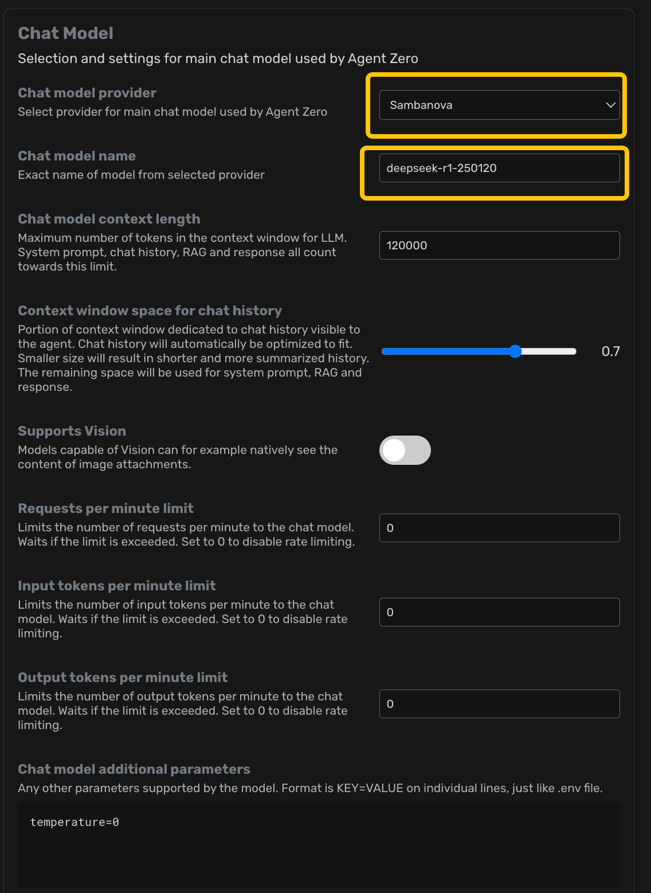
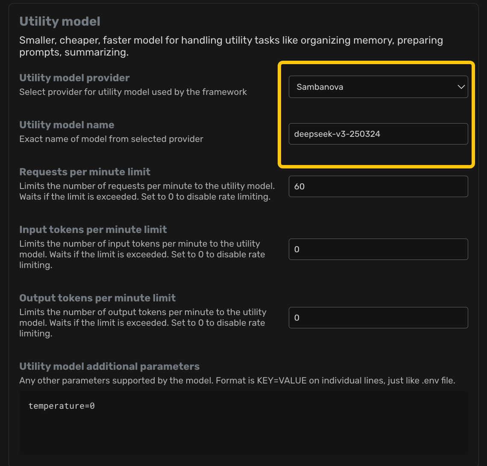
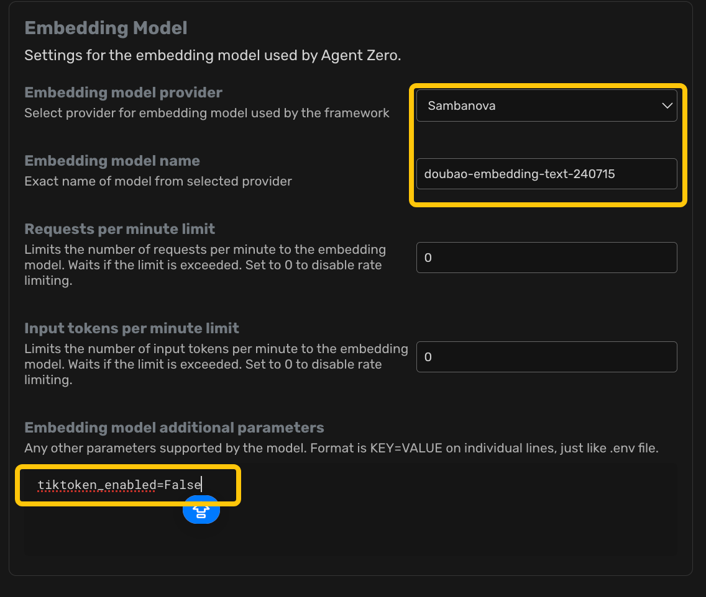
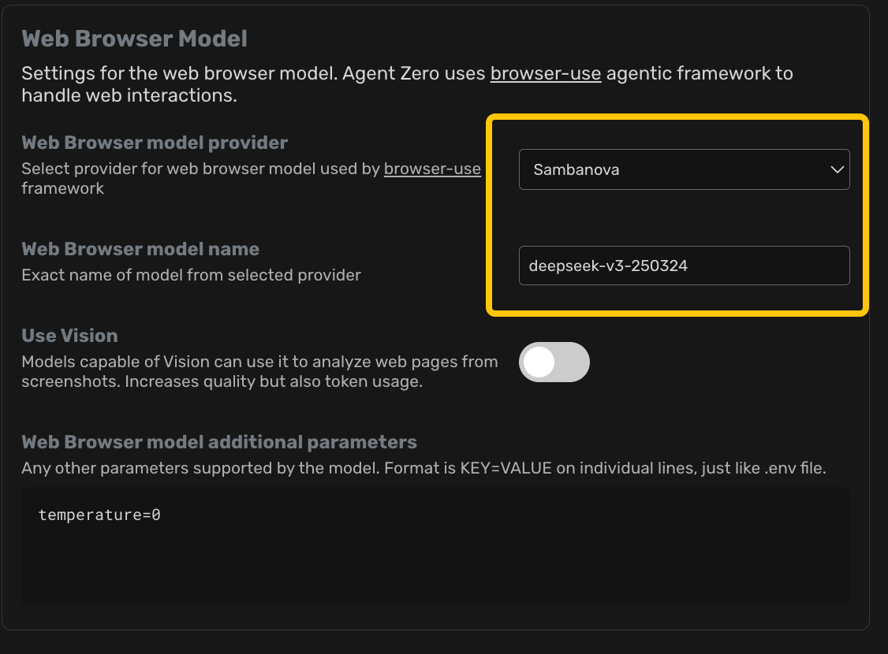
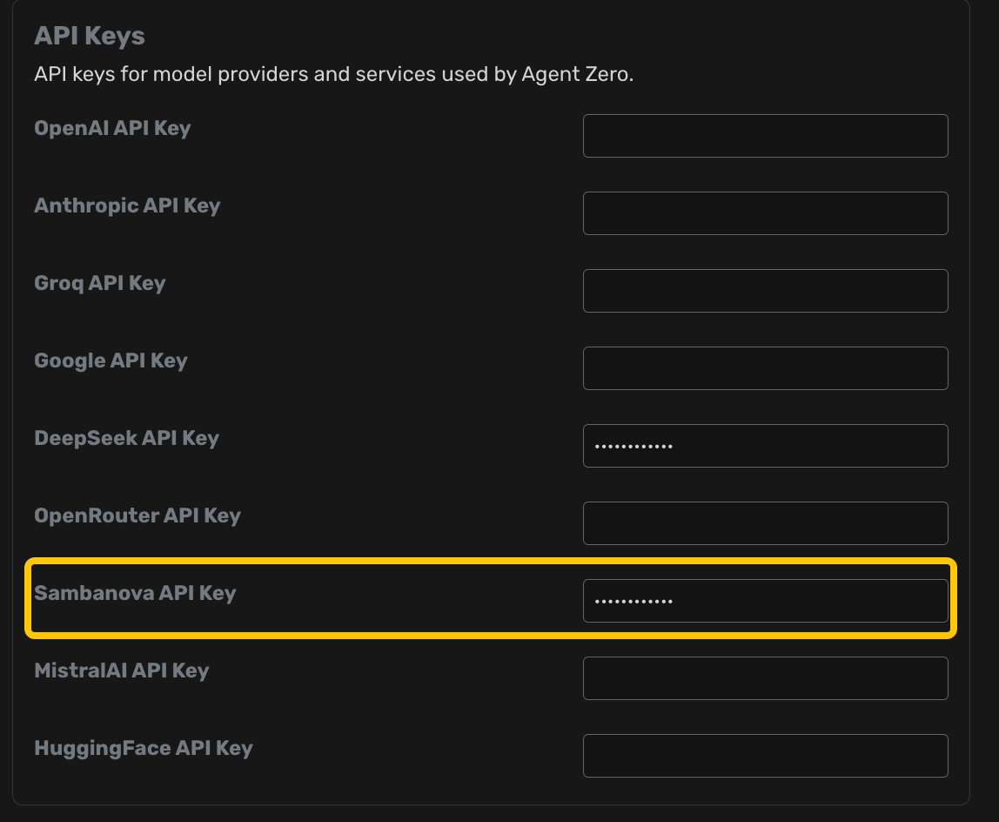

# 安装方法

在按照 https://github.com/frdel/agent-zero 的安装方法，下砸好 docker 之后，执行时需要附加一下操作
1. 挂载 agent-zero-fix 目录 到 docker 的 /a0-fix 下
2. 启动 docker，然后在 其中的 bash 中执行 bash /a0-fix/init.sh
3. 配置文件 /a0/.env 中增加以下配置

```
SAMBANOVA_BASE_URL=https://ark.cn-beijing.volces.com/api/v3
```
会将 sambanova 的接口用 火山引擎的接口替换掉

4. 配置用做如下配置









用 Sambanova 的接口 api key 使用火山的 key 即可

